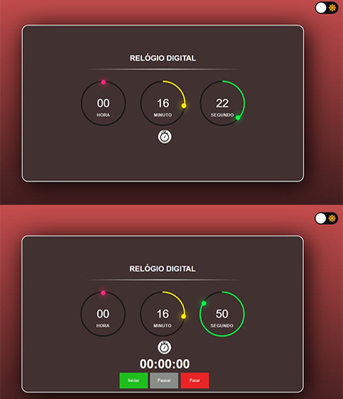

<h1 align="center"> RELÓGIO DIGITAL</h1>

<h2>OBJETIVO</h2>

Criar um relógio digital utilizando html, css e javaScript. Acrescentei um cronômetro escondido e um botão Dark/Light.

<h2> RESULTADO</h2>

<h2>ACESSE</h2>

https://tstavale.github.io/relogio_digital/

<h2>FERRAMENTAS</h2>

<ul>
  <li>HTML</li>

  <li>CSS</li>

  <li>JAVASCRIPT</li>
</ul>
